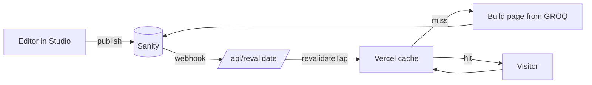

# COMMVIEW Site & Blog — Build Plan

## What we're building

A marketing site that turns a stranger's vague worry into a qualified conversation, with a publishing engine behind it and a CRM in front of it.

Not a brochure. The homepage already does the hard part — it names symptoms rather than services, which is how someone recognises themselves before they know what to ask for. Everything else exists to serve that moment.

The site has three jobs, in this order:

1. **Be found.** Someone searches a symptom, not a service. "Why is our pipeline down", not "fractional GTM consultant". The blog is the surface that ranks for those; the service pages convert once they arrive.
2. **Be understood in ninety seconds.** What COMMVIEW does, who it is for, and why an operator-led fractional model beats an agency. The homepage does this already.
3. **Capture intent at three temperatures.** Hot goes straight to a call. Warm takes the diagnostic. Cold subscribes. All three land in one place, tagged by what brought them.

That third job is the one most consultancy sites get wrong. They have one CTA — book a call — which only catches people who were already going to book. The diagnostic and the newsletter exist to catch the other eighty per cent, and to give us a reason to follow up that isn't "just checking in".

## Architecture

One Next.js app on Vercel, with the Sanity Studio embedded in it. One repo, one deploy, one domain.

**Stack**

| Layer | Choice | Why |
| --- | --- | --- |
| Framework | Next.js 15, App Router, TypeScript | Static generation per route with per-path revalidation |
| CMS | Sanity v3, Studio embedded at `/studio` | No second deploy, no CORS dance, editors log in on the live domain |
| Host | Vercel | Zero-config, preview deploys per branch, ISR built in |
| Styling | Plain CSS — tokens + component sheets | Already written and verified; a CSS framework would fight the design system |
| Forms | Server Actions → a single `lib/crm/` adapter | The CRM stays swappable |
| Analytics | Vercel Analytics + Plausible or GA4 | Decide at Phase 2 |

No Tailwind, no UI library, no state manager. The three mocks are already complete CSS; the port is markup into components with the stylesheets lifted verbatim.

**Repo shape**

```
app/
  (site)/page.tsx                    homepage
  (site)/[slug]/page.tsx             what-we-do, how-we-work, about, work
  (site)/insight/page.tsx            blog index
  (site)/insight/[slug]/page.tsx     article
  (site)/insight/topic/[slug]/       category, + /page/[n] pagination
  (site)/diagnostic/                 tool, + /result/[id]
  api/revalidate/route.ts            Sanity webhook target
  studio/[[...tool]]/page.tsx        embedded Studio
  sitemap.ts  robots.ts  opengraph-image.tsx
components/  blog/  site/  diagnostic/  portable-text/
lib/  sanity/ (client, queries, image)  crm/ (adapter)  diagnostic/ (scoring)
sanity/schemas/
styles/  tokens.css  chrome.css  blog.css  article.css
```

**How a page gets built**



Every route is statically generated and tagged. Publishing a post revalidates only the paths that post touches — the article, its topic page, the index, the sitemap. No full rebuild, so publishing is near-instant and the site stays static for everyone else.

**Rendering per route**

| Route | Strategy |
| --- | --- |
| Homepage, service pages | Static, tag-revalidated |
| Blog index, topic pages | Static, `generateStaticParams`, tag-revalidated |
| Articles | Static, tag-revalidated |
| Diagnostic | Client component, no CMS read at runtime |
| Diagnostic result | Dynamic, rendered from a stored submission |
| Studio | Client-only, `noindex` |

**The two seams that matter**

Everything that talks to the outside world goes through one file each, so neither vendor reaches into the components:

- `lib/sanity/queries.ts` — every GROQ query, typed. Nothing else in the app imports the Sanity client.
- `lib/crm/index.ts` — one interface: `identify(contact)`, `track(event)`, `subscribe(email, source)`. HubSpot sits behind it. Swapping to something else means rewriting one file, not hunting through forms.

**Environment variables**

`NEXT_PUBLIC_SANITY_PROJECT_ID`, `NEXT_PUBLIC_SANITY_DATASET`, `SANITY_API_READ_TOKEN` (draft previews), `SANITY_REVALIDATE_SECRET`, `HUBSPOT_PRIVATE_APP_TOKEN`, `NEXT_PUBLIC_SITE_URL`.

## Sitemap and URL structure

Flat, shallow, and shaped around the four capabilities — because those are the four things people search, and the four things every piece of content belongs to.

| URL | Page | Source | Phase |
| --- | --- | --- | --- |
| `/` | Homepage | Hardcoded (copy is locked) | 1 |
| `/what-we-do` | The four capabilities, expanded | Sanity page doc | 2 |
| `/what-we-do/gtm-leadership` | Capability detail ×4 | Sanity page doc | 3 |
| `/how-we-work` | Insight → Momentum → Impact | Sanity page doc | 2 |
| `/work` | Case studies index | Sanity | 3 |
| `/work/[slug]` | Case study | Sanity | 3 |
| `/about` | Operator-led, the people | Sanity page doc | 2 |
| `/insight` | Blog index | Sanity | 1 |
| `/insight/[slug]` | Article | Sanity | 1 |
| `/insight/topic/[slug]` | Topic ×4 | Sanity | 1 |
| `/insight/topic/[slug]/page/[n]` | Topic pagination | Sanity | 1 |
| `/insight/tag/[slug]` | Tag | Sanity | 2 |
| `/diagnostic` | The tool | Hardcoded questions | 2 |
| `/diagnostic/result/[id]` | Result, shareable | Stored submission | 2 |
| `/contact` | Form + direct email | Hardcoded | 1 |
| `/privacy`, `/terms` | Legal | Sanity page doc | 1 |
| `/studio` | Sanity Studio | — | 1 |

**Decisions baked into that shape**

`/insight` not `/blog`. It matches the brand line, and "blog" signals a content mill. Costs nothing in SEO — Google does not favour `/blog`.

`/insight/[slug]` with no date and no topic in the path. A dated URL ages the piece publicly and makes republishing a decision rather than an edit. A topic in the path locks a post to one category forever; posts genuinely straddle GTM and Growth.

Topics live at `/insight/topic/[slug]` so a post can belong to one topic and several tags without the URL fighting it.

`/what-we-do/[capability]` in Phase 3 rather than Phase 1. Four capability pages with thin copy are worse than one strong page. Build them when there is a case study and a real point of view to put on each.

**Machine-readable layer**

`app/sitemap.ts` generates from Sanity, so a published post is in the sitemap within seconds of the webhook firing. `robots.ts` allows everything except `/studio`, `/api` and `/diagnostic/result`. Every page carries a canonical. Organization schema is defined once on the homepage and referenced by `@id` everywhere else — already how the mocks are built.

## Sanity content model

Six document types. Five are obvious; the sixth — `page` — is what stops the service pages becoming hardcoded copy nobody can edit.

**`post`** — the article

| Field | Type | Notes |
| --- | --- | --- |
| `title` | string | required, max 70 for SERP |
| `slug` | slug | from title, editable |
| `standfirst` | text | required, 120–200 chars, doubles as meta description |
| `body` | array (Portable Text) | blocks below |
| `coverImage` | image | hotspot on, `alt` required |
| `category` | reference → category | required, exactly one |
| `tags` | array of references → tag | optional |
| `author` | reference → author | required |
| `publishedAt` | datetime | required |
| `takeaways` | array of strings | 2–4, renders the "In short" box |
| `faqs` | array of `{question, answer}` | renders FAQ + `FAQPage` schema |
| `featured` | boolean | one true post leads the index |
| `relatedPosts` | array of references | falls back to same-category if empty |
| `seo` | object | `title`, `description`, `ogImage`, `noIndex` |

`readTime` is computed from the body at query time, not stored — a stored number goes stale the moment someone edits.

**`category`** — `title`, `slug`, `description`, `colour` (list: cyan / green / blue / pink, mapping to the four capabilities), `order`. Fixed at four. Adding a fifth means the homepage Venn is wrong too, so it should be a deliberate act.

**`tag`** — `title`, `slug`. These are the sub-filters on a topic page. Free-form and cheap.

**`author`** — `name`, `slug`, `role`, `bio`, `image`, `initials`, `linkedIn`. Initials are stored, not derived, because "Asad Ali" and a two-word surname behave differently.

**`page`** — `title`, `slug`, `sections` (array of section objects), `seo`. Service pages are composed from a small set of section types rather than free Portable Text, so they cannot drift off the design system.

**`siteSettings`** — singleton. Nav items, footer links, social URLs, default OG image, the contact email, the subscribe copy. Anything that would otherwise be hardcoded in two places.

**Portable Text blocks the article template already styles**

Standard: h2, h3, paragraph, bold, italic, inline link, bullet list, numbered list, blockquote (renders as the pull quote), horizontal rule.

Custom objects: `figure` (image + caption + alt), `callout` (`label` + `text`), `codeBlock` (`language` + `code`), `table`, `postReference` (an inline link to another post that renders as a card).

Every one of those has CSS in the mock already. Claude Code should map, not design.

**Editorial workflow**

Drafts live in Sanity as `drafts.<id>` and never reach the public site. A preview route reads drafts using `SANITY_API_READ_TOKEN` so a post can be seen at its real URL before publishing. Publishing fires the webhook, which revalidates the article, its topic page, `/insight` and the sitemap.

One validation rule worth enforcing from day one: a post cannot publish without `standfirst`, `coverImage.alt`, `category` and at least two `takeaways`. Those are the four fields that, when missing, quietly break SEO and the answer-engine block.

## The diagnostic tool

This is the most commercially important thing on the site, and the easiest to build badly.

The homepage already promises it: five minutes, and it returns strengths, weaknesses, blind spots and first moves across the four capabilities. That promise sets the spec.

**What it must not be**

A lead-gen quiz with a foregone conclusion. If every result says "you need COMMVIEW", it is worthless and people can smell it in three questions. The result has to be genuinely useful to someone who never hires you — that is exactly why the ones who do hire you will trust it.

**Shape**

20 questions, five per capability, answered on a four-point scale. No neutral option — a midpoint is where people hide. Roughly four minutes at honest pace.

Each question is a statement about the business, and the respondent says how true it is:

> "We can name the three reasons we lose deals, and they are the same three across the team."

Not true / Somewhat / Mostly / True. Plain business language, no jargon, no scoring visible during the run.

**Scoring**

Four scores out of 20, one per capability. The interesting output is not the scores themselves but their relationship:

| Pattern | What it says | What the result leads with |
| --- | --- | --- |
| One capability well below the others | A clear weak link | Fix that one first, here is the sequence |
| All four middling | No foundation under any of it | Positioning first — everything else compounds off it |
| High GTM, low Product | Selling something the product cannot yet carry | The gap between promise and delivery |
| High Growth, low GTM | Spending efficiently on the wrong message | The most expensive pattern of the four |
| All four high | Genuinely in good shape | Say so, name the one marginal gain, do not manufacture a problem |

The scoring rules live in `lib/diagnostic/scoring.ts` as pure functions with unit tests. Not in a component, not in Sanity. They will get tuned, and tuning needs a test suite.

**Result page**

Four scores as a small chart, then the pattern read in plain prose, then three first moves ranked by what to do this week, this month and this quarter. Two or three linked articles that match the weakest capability — which is the moment the blog pays for itself.

Results are stored and get a shareable URL at `/diagnostic/result/[id]`. Shareable because a COO forwarding their result to a CEO is the single highest-intent thing that can happen on this site.

**Where the email sits**

After the answers, before the result. Not a gate on the result — the result shows either way — but the natural moment to offer to send it. "See your result" and "Email it to me as well" side by side. Gating it entirely would cost more in abandonment than it wins in addresses.

**Data**

The submission — answers, scores, pattern, timestamp, and email if given — goes to Supabase or Vercel Postgres, not Sanity. Sanity is a CMS and submissions are not content; they are rows, they accumulate fast, and you will want to query them. The email also goes to the CRM through the same `lib/crm` adapter, tagged with the pattern and the weakest capability.

That tagging is the point. Six months in, you can email everyone whose weak link was Operational AI when you publish something on it. That is a real list, segmented by a stated problem, which is worth more than a newsletter of ten times the size.

## CRM and email

My recommendation: **HubSpot free tier now, behind an adapter, with Resend for transactional email.** Do not commit to a paid marketing platform until the list is real.

**Why HubSpot**

| | HubSpot free | Brevo | ConvertKit / Kit | Just Resend + Postgres |
| --- | --- | --- | --- | --- |
| CRM with deal pipeline | Yes | Thin | No | No |
| Cost at 0–1,000 contacts | £0 | £0–25/mo | £0–25/mo | ~£0 |
| Cost at 5,000 contacts | £0 CRM, ~£45/mo marketing | ~£40/mo | ~£50/mo | ~£10/mo |
| Segmentation on custom properties | Yes | Yes | Yes | You build it |
| Meeting booking links | Yes, free | Paid | No | No |
| Time to working | An afternoon | An afternoon | An hour | A week |

The deciding factor is not email. It is that you are running a consultancy with a handful of high-value conversations at a time, and you need a place to see them. HubSpot's free CRM plus meeting links does that on day one at no cost, and the free tier is genuinely usable rather than a trial.

The risk is the classic one — HubSpot gets expensive exactly when it starts working. Which is what the adapter is for.

**The adapter**

```ts
// lib/crm/index.ts
export interface CRM {
  identify(c: { email: string; firstName?: string; company?: string;
                properties?: Record<string, string | number> }): Promise<void>
  track(e: { email: string; event: string;
             properties?: Record<string, unknown> }): Promise<void>
  subscribe(email: string, source: string): Promise<void>
}
```

Three methods. Every form, the diagnostic and the subscribe box call only these. `lib/crm/hubspot.ts` implements them. Moving to something else is one new file and one line changed.

**What gets captured, and with what**

| Event | Trigger | Properties on the contact |
| --- | --- | --- |
| `subscribed` | Newsletter form | `source` (which page) |
| `diagnostic_completed` | Diagnostic finished | four scores, `pattern`, `weakest_capability` |
| `contact_requested` | Contact form | `message`, `company`, `how_they_found_us` |
| `article_read` | Phase 3, known contacts only | `article`, `category` |

Those custom properties are the whole value. A contact record that says "weakest capability: Product, pattern: selling ahead of delivery, read three GTM articles" is a briefing before a call, not a row in a list.

**Transactional vs marketing email**

Two different jobs, two different tools, and conflating them is a common mistake.

Transactional — diagnostic results, contact form confirmations — goes through **Resend**. React Email templates in the repo, versioned with the code, styled with the design system. Cheap and reliable.

Marketing — the monthly piece — stays in HubSpot while the list is small, because keeping subscribers and contacts in one system is worth more than a marginally nicer editor. Revisit at around 2,000 subscribers.

**Compliance, briefly**

UK GDPR: an explicit opt-in checkbox on the subscribe form, not pre-ticked. A visible privacy notice at the point of capture. One-click unsubscribe in every marketing email. The diagnostic states that the result is emailed only if an address is given. Cookie consent is only needed once analytics that set cookies go in — Plausible avoids it entirely, GA4 does not. Worth factoring into that choice.

## Content requirements

The code is not the bottleneck. Copy is. Everything below is on you, and most of it blocks a phase.

| What | Size | Blocks | Notes |
| --- | --- | --- | --- |
| Three launch articles | 1,200–1,500 words each | Phase 1 going live | One per topic except Operational AI — an empty topic page looks worse than three topics |
| Topic descriptions ×4 | 30 words each | Phase 1 | Drafted in the mocks; approve or rewrite |
| Your author bio | 60–80 words | Phase 1 | Why you are worth reading on this, not a CV |
| Contact page | 80 words + form labels | Phase 1 | What happens after they send it |
| Privacy + terms | Standard | Phase 1 | A template is fine, but it must be accurate about the diagnostic |
| `/what-we-do` | 600–800 words | Phase 2 | Expands the four capabilities the homepage names |
| `/how-we-work` | 400–600 words | Phase 2 | Insight → Momentum → Impact, expanded |
| `/about` | 400–600 words | Phase 2 | Operator-led is the whole argument |
| 20 diagnostic questions | 5 per capability | Phase 2 | The hardest writing on this list — see below |
| Result copy | 5 patterns × ~150 words | Phase 2 | Plus three first moves per pattern |
| Two case studies | 600–800 words each | Phase 3 | Needs client permission — start asking now |
| Client logos | — | Phase 2 | Trust strip is text today; logos need permission |

**The three launch articles**

Write these before anything else, because they are what proves the templates and they are what the site is for. Suggested, each of which you can already argue in your sleep:

1. Why pipeline problems are usually positioning problems — GTM Leadership
2. What good ICP work actually looks like — GTM Leadership or Growth
3. Launching is not the milestone — Product

Each needs a title, standfirst, body, two to four takeaways and two or three FAQs. The takeaways and FAQs are not decoration — they are the blocks answer engines lift, and a post without them is invisible to that traffic.

**The diagnostic questions**

Budget real time for these. Twenty statements that a founder can answer honestly in fifteen seconds each, that discriminate between a business that has the thing and one that does not, and that do not telegraph the right answer. Written badly, everyone scores 14/20 and the tool is useless.

The test for each one: could a business genuinely answer "not true" without feeling stupid? If not, rewrite it.

**Cadence after launch**

One piece a month is what the site promises, and it is the right number for a one-person consultancy. Two a month is better if sustainable. Nothing for three months is worse than never starting, because the newest date on the index becomes a statement about the business.

**A note on placeholder copy**

Every word in the three blog mocks is placeholder and none of it should ship. The locked homepage copy is the only approved copy on the site today.

## Phases

Four phases. Each one ends with something live, because a site that goes dark for six weeks while the "full build" happens is how these projects die.

**Phase 0 — Foundations.** Half a day, mostly yours.

Sanity project created. GitHub repo. Vercel connected. Domain pointed. Next.js scaffolded with the Studio embedded, the design system CSS in place, and one page rendering from Sanity to prove the pipe works end to end. Nothing public.

Done when: `/studio` loads on the Vercel URL and a test document renders on a page.

**Phase 1 — Site live with the blog.** The real launch.

Homepage ported with its locked copy. Contact page with a working form. Blog index, article and topic routes, all reading from Sanity. Three articles written and published. Subscribe form wired to HubSpot. Sitemap, robots, canonicals, OG images. Privacy and terms. Domain live.

Done when: commview.co.uk serves the homepage, three articles are published from the Studio, and a subscribe lands in HubSpot.

This is the phase that matters. Everything after it is addition, not launch.

**Phase 2 — Service pages and the diagnostic.**

`/what-we-do`, `/how-we-work`, `/about` built from the `page` type. All seventeen placeholder links on the homepage now resolve. Diagnostic built: twenty questions, scoring, result page, shareable URL, submissions stored, results emailed via Resend, CRM tagged with pattern and weakest capability. Analytics in.

Done when: someone can complete the diagnostic, get a result they would forward to a colleague, and land in HubSpot tagged by their weak link.

**Phase 3 — Depth.**

Case studies. Four capability detail pages. Tag pages. Related-post logic improved past same-category fallback. Possibly `article_read` tracking for known contacts.

Done when: the site can carry a sales conversation without you sending anything alongside it.

**Rough effort**

| Phase | Build | Your input |
| --- | --- | --- |
| 0 | 2–3 hours | 30 min of account setup |
| 1 | 2–3 days | 3 articles + contact and legal copy |
| 2 | 3–4 days | 3 pages + 20 questions + result copy |
| 3 | 2–3 days | 2 case studies + client permission |

Build time assumes Claude Code working against this spec with the mocks as reference. The long pole in every phase is copy, not code.

**Sequencing note**

Do not build the diagnostic in Phase 1, however tempting. It is the highest-value thing on the site and it deserves questions you have had time to sharpen. Launching without it costs nothing; launching with a mediocre version of it costs the credibility of the whole idea.

## Decisions still open

Roughly in order of how expensive they get to change later.

- [ ] **Do you own commview.co.uk?** Every canonical in the mocks assumes it. If it is something else, it is a find-and-replace now and a migration later.
- [ ] **"Insight" or "Blog"** as the section name and URL. Changing it after posts are indexed means redirects.
- [ ] **Submissions database** — Supabase or Vercel Postgres. You already run Supabase on Lintel, which argues for Supabase on familiarity alone.
- [ ] **HubSpot free tier**, or something leaner. My recommendation is above; it is your call and the adapter makes it reversible.
- [ ] **Plausible or GA4.** Plausible costs ~£9/mo and needs no cookie banner. GA4 is free and needs one. For a site this size the banner probably costs more in conversion than Plausible costs in cash.
- [ ] **Self-host Inter or keep Google Fonts.** Self-hosting removes a render-blocking third-party request and one GDPR argument. Recommend self-hosting; it is twenty minutes.
- [ ] **Does anyone else edit content?** If it is only you, Sanity's free tier is fine indefinitely. Two editors is still free; three is not.
- [ ] **Case study permission** — worth asking the Vodafone and ADI contacts early, since Phase 3 depends on it and these conversations take weeks.
- [ ] **Real client logos for the trust strip**, or keep it as text. Text is honest and works; logos need permission you may not have.

**What I need before starting Phase 0**

The domain answer, the section name, and the submissions database. The rest can wait until the phase that needs them.
